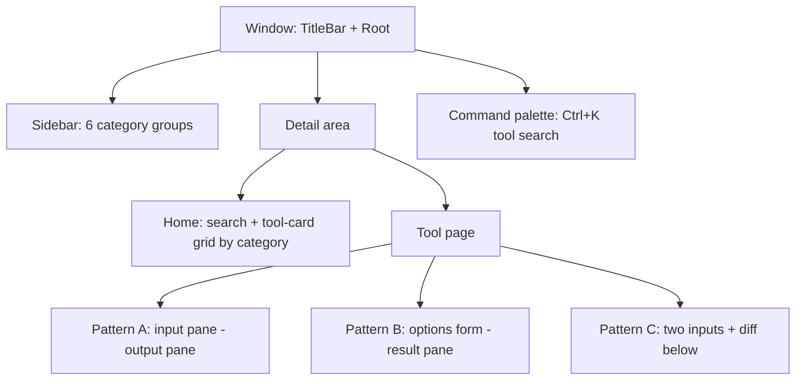

# Phase 7 UI — Design Plan ("oxide-design")

Status: draft for Phase 7.1–7.2 planning. Inspiration: IT-Tools
(`https://it-tools.tech/`), specifically its markdown-to-html layout — made
more minimalist and desktop-native, with a Rust-orange accent and light/dark
themes. This document is a requirement for UI work, not inspiration: read the
vendored design guides (`.agents/skills/gpui-kit-design-guides/references/design-guides.md`)
before changing it.

## 1. Start from the task

| Question | Answer |
|---|---|
| Primary task | Pick a tool, configure it, **run it, read the result, copy/export it** |
| Stable object | **Tools** grouped by the six CLI categories (never the internal crate layout) |
| Immediately-available actions | Run, Copy, Export to file, Search (⌘K / Ctrl+K) |
| Information needed to decide | Each tool's options — the same `Options` structs the CLI maps |
| States to design | Empty (no tool selected), loading (real waiting only), error (inline, near the field), read-only result |
| Keyboard path | Sidebar Tab navigation, command palette jump, Enter = run, Escape dismisses topmost overlay |

Shell choice (design-guides §Layout patterns): **sidebar workspace** —
persistent category navigation beside a changing detail view.

## 2. What we borrow from IT-Tools, and what we change

| IT-Tools idea | Desktop adaptation |
|---|---|
| Searchable grid of tool cards on home | Same — cards grouped by the six categories, keyboard-reachable, palette on top |
| Two-pane tool page (input/options → output) | Same core pattern — generalized into Pattern A/B/C below |
| Category menu on the left | Persistent, resizable **sidebar** (desktop convention), not a web drawer |
| Dark/light toggle | System-following default + manual override in Settings |
| Web styling habits (hover toolbars, link-buttons, full-page scroll) | Dropped — Button vs Link rules, keyboard paths, region-owned scrolling only |

Minimalism rules: **one accent color** (orange), borders over heavy shadows, no
gradients, monospace only where content is data, no footer catch-all.

**Visual reference**: `docs/design/mock/` — a static HTML/CSS preview of this
design (home grid, tool pages A/B/C, settings, component states, light/dark).
It is the eyes-on validation artifact and the acceptance reference: every
implemented screen must match it until a design review explicitly changes it.

## 3. Design language

### 3.1 Palette — semantic tokens

Defined in exactly one theme module; components read `cx.theme()` tokens only
(tokens before values — no raw hex anywhere else). Values are starting points;
the design review may tune them.

| Token | Dark | Light | Role |
|---|---|---|---|
| `primary` | `#CE422B` (Rust orange) | `#CE422B` | Primary buttons, active nav, focus rings, selection |
| `primary-hover` | `#DD5A3F` | `#B83A26` | Hover on primary surfaces |
| `background` | `#0E0E0F` | `#FFFFFF` | Window background |
| `surface` | `#17181A` | `#F7F7F8` | Cards, panels, inputs |
| `border` | `#2A2C2F` | `#E4E5E7` | Hairlines — preferred over shadows |
| `foreground` | `#F2F2F3` | `#17181A` | Text |
| `muted` | `#8E9094` | `#6B6E73` | Descriptions, placeholder, inactive |
| `danger` | `#E5484D` | `#B91C1C` | Destructive — never orange, stays distinct from brand |
| `success` | `#30A46C` | `#15803D` | Validation verdicts |

- Orange-tinted hover/focus states elsewhere (transparent overlays at ~10%).
- Tabular numerals for counts, sizes, and timestamps in outputs.

### 3.2 Type, spacing, shape

- Base font and rem scaling from the gpui-kit theme (the zoom control).
- **Monospace for all result/output surfaces** — outputs are data (UUIDs, JSON,
  diffs), visually separated from UI copy.
- Medium density default; compact only inside dense data views (diffs, long JSON).
- Small radii, hairline borders, minimal elevation — minimal look.
- Icons: Lucide via `Icon`/`IconName`; one icon per tool card, no decoration.

### 3.3 Interaction states (must be visible)

Hover (surface tint) · focus (orange ring, never clipped by overflow) ·
selected (orange left-rail or tinted card) · disabled (muted, with a reason
where needed) · loading (spinner only for real waiting) · validation (inline
beside the field) · destructive (danger token + named verb).

### 3.4 Motion

Short transitions for appearance/dismissal/expansion only; honor
reduced-motion; never required to understand state (design-guides §Motion).

## 4. Layout system

- **Shell**: TitleBar (drag region, window controls) → Sidebar (categories as
  expandable/collapsible groups, tools as items, visible active state) →
  detail area (`flex_1()`, `min_w_0()`). Minimum window size enforced
  (~900×640) so every tool displays correctly; sidebar resizable; Escape
  dismisses topmost overlay and returns focus to its trigger.
- **Home**: search input **centered at the top** of the page + tool cards grouped
  by category. Card = icon + two lines: tool name on line 1, one-line
  description on line 2; hover/focus/selected states; Enter opens.
- **Tool page** (the markdown-to-html pattern, generalized):
  - **Pattern A — Transform** (codecs, converters, most text tools): left pane
    input(s) + mode selectors (`Tabs` or `Select`), right pane output with
    `Copy` / `Export…`.
  - **Pattern B — Generator** (id, key, lorem, fake, sample): left pane options
    form, right pane result + regenerate + copy; sample files add a save action.
  - **Pattern C — Compare/Validate** (diff, validators): comparators = two
    inputs + diff output below; validators = input + inline verdict
    (`Badge`/`Tag`) + details list.
- **Placement and resizing**: tool content is **top-centered**. Patterns A/B
  are capped at ~1060px and stretch to fill the remaining window height (panes
  scroll internally); Pattern C is a centered column capped at 560px. The
  window enforces a minimum size (~900×640) so every tool displays correctly.
- **Search**: the search input sits at the **very top center of every page**, above the page title (global tool search, not just home). The icon lives in an isolated slot separated by a hairline from the text field (`| icon | text |`, `Ctrl K` chip at the end); focus ring on the whole component. The command palette (⌘K / Ctrl+K) jumps to any tool and the home search filters cards live.

## 5. Component mapping (region → gpui-kit component)

| Region | Component(s) |
|---|---|
| Window | `Root`, `TitleBar`, theme system (`Theme`) |
| Navigation | `Sidebar`/`SidebarMenu`; `Command` + `CommandState` palette |
| Forms | `Form` (`v_form`/`h_form`/`field`), `Input`, `Textarea`, `NumberInput`, `Select`, `Checkbox`, `Switch`, `Radio` |
| Actions | `Button` (primary = run commit), `DropdownButton` (secondary), `Clipboard` (copy), `Kbd` (shortcuts) |
| Output | `TextView` (mono), `Scrollable`; `Resizable` for pane split |
| Feedback | `Badge`/`Tag` (verdicts), `Alert` (errors near input), `Notification` (async done), `Progress`/`Spinner` (long ops), `Dialog`/`AlertDialog` (export overwrite), `Tooltip` (shortcut or ambiguous scope only) |
| Shell-level | `GroupBox` (related options), `Tabs` (modes), `Empty` (no tool selected) |

Only `tool_card` and `tool_field` get wrapped as app components (they carry
domain policy); everything else is composed as-is (components-and-composition
rules).

## 6. Theme architecture

- Light + dark themes via the gpui-kit `Theme` system (colors, typography,
  radii, appearance).
- Default follows the system appearance; Settings offers System / Light / Dark.
- Theme definition is one module; switching must not lose focus or state.

## 7. Interface lexicon

- **Sidebar destinations**: category nouns (`Generators`, `Codecs`, `Text`,
  `Converters`, `Validators`, `Comparators`) and tool names (`UUID`,
  `Password`, `Base64`, `Email`, `JSON`, `Diff`…).
- **Commands**: verbs — `Generate`, `Validate`, `Convert`, `Compare`, `Copy`,
  `Export…` (ellipsis only when more input follows).
- **States**: `Ready`, `Running`, `Done`, `Invalid`.
- No `Management`/`Module`/`System` wrappers; sentence case; confirmations name
  object and verb (`Delete "Recent runs"?` + `Delete`); no `Are you sure?`/`OK`.

## 8. Non-negotiables

- Button for every in-app command; `Link` only for external URLs.
- Tokens before values — raw hex only in the theme module.
- State must be visible (hover, focus, selection, disabled, loading,
  validation, destructive).
- Escape dismisses the topmost surface and returns focus to its trigger.
- One accent color; no gradients; mono for data only; no footer catch-all.
- Never invent a gpui-kit API — verify against the component docs
  (`https://gpui-kit.com/component/{name}.md`) and vendored references.

## 9. Agent skills & workflow

| Skill | Role |
|---|---|
| `ui-workflow` | Orchestrator for all UI tasks (mirrors `new-tool-workflow`); routes design → coding → test rules → security gates |
| `ui-base-design` | Owns this design language; the contract every new tool page follows |
| `add-tool-ui` | Recipe for adding one tool page (e.g. `codecs` → base64) |
| `gpui-kit-design-guides` | Normative design rules — read the guide file, not this summary |
| `gpui-kit` | Coding rules, component catalog, GPUI mechanics |
| `security-audit` | Mandatory gate before `gpui-kit` enters `[workspace.dependencies]` |

Component tests follow
`.agents/skills/gpui-kit/references/component-test-rules.md`.

## 10. Gates & checklists

- Design review checklist + accessibility checklist (design-guides) run against
  this document at design completion, and against every shipped screen.
- Workspace gates: `cargo fmt --all --check`, clippy `-D warnings`, nextest
  `--all-features --locked`, `cargo deny check`, coverage ≥ 50%.
- Packaging stays deferred to Phase 10.

## 11. Open items for the design review

- Confirm the exact primary hue (Rust orange `#CE422B` vs alternatives) in both
  themes; check contrast for focus rings and `primary` on `surface`.
- Decide the minimum window size and sidebar collapse behavior on narrow
  windows.
- Decide sample-file tools' save path UX (Pattern B extension).
